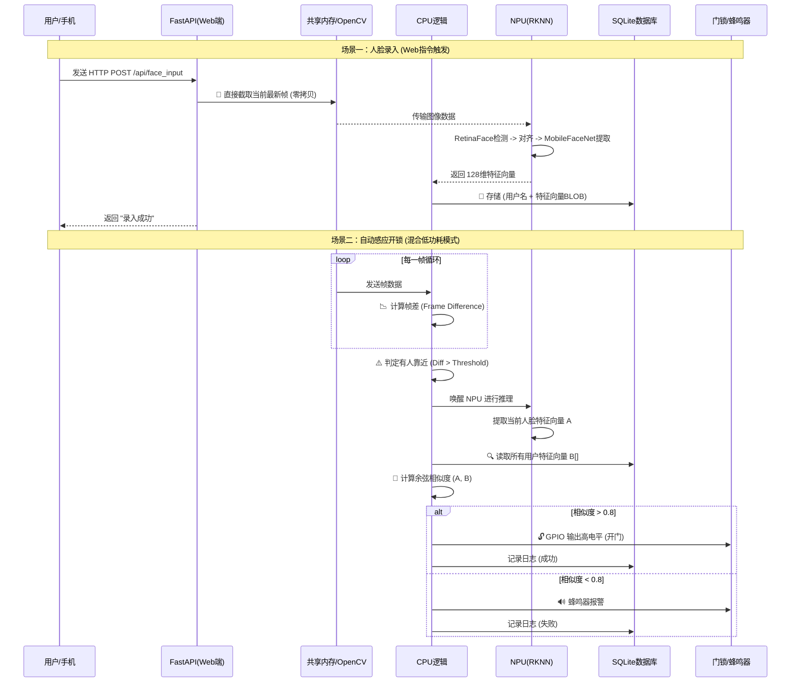

# 智能系统设计

## 设计名称

项目的系统设计为 **人脸识别门禁**。

## 项目目标

项目应该可以实现以下功能：

1. 用户可通过传统密码（手动输入数字密码）和人脸识别完成解锁
2. 可使用 ov5695模块扫描人脸
3. 用户可向门禁录入人脸和设置密码
4. 用户可以选择重置人脸和传统密码

## 系统架构

系统分为三层：数据输入层 -> 数据处理层 -> 数据响应层。

### 数据输入层

用户可**在登录系统后**调用 ov5695模块录入人脸、设置传统密码。并且可选择重置人脸、重置密码，修改登录密码的功能。

### 数据处理层

**核心是人脸识别模块**。

1. **人脸识别模块**：
   1. 登陆后录入人脸： 能够将 ov5695的人脸输入存储进数据库里，方便以后人脸比对验证，进而解锁门禁
   2. 检测人脸：和数据库里存储的人脸进行比对，如果比对成功，解锁门禁；如果失败，提示重新录入，一分钟内只能比对 10次。
2. **传统密码模块**：
   1. 登陆后设置密码：将设置好的新密码写入数据库
   2. 门禁密码验证：将用户使用键盘外设输入的密码和数据库存储的密码对比，如果密码正确，解锁门禁；如果失败，提示重新录入，一分钟内只能比对 5次。

### 数据响应层

用户如果通过 "人脸验证"、"传统密码"其中一种方式成功匹配，那么就打开门锁，并给出提示音。

## 硬件

1. RK3568开发板
2. 4x4 薄膜按键按键，用于输入传统密码
3. ov5695 摄像头模块

## 设计难点

### 数据输入设计

1. RK3568 实现 人脸录入、密码录入的方式

2. RK3568 实现账户登录的方式：

   1. 怎么将用户的账号、密码存储进开发板
   2. 用户怎么登录账号并跳转到人脸录入、密码输入页面

   **设想方案**：

   1. 使用 RK3568搭建一个前后端系统，提供前端页面，用户可使用手机访问 url进行登录
   2. （需要增加一个屏幕外设）：构建系统前先设置默认账号和密码，用户使用蓝牙，或者扫描门禁的屏幕二维码进行登录。登陆后可修改登录账号和登录密码

3.  没有登录前，当人靠近后，ov5695是自动响应人脸检测，还是需要人按下键盘某一个键后开启人脸检测?

###  数据处理方面

1. RK3568 怎么存储：录入的人脸、登录账号、登陆密码、传统密码。
2. 不使用登录功能时，RK3568 怎么处理 ov5695的输入人脸，并和数据库里的人脸做比对
3. RK3568 怎么处理输入的密码和数据库里存储的传统密码做比对

### 数据响应层

比对成功后，输出什么信号解锁门禁?

---

## 解决方案

### 需求理解

基于 RK3568 平台开发一款 “多模态生物识别智能门禁系统”

**核心逻辑**：

1.  **双模验证：** 支持 **人脸识别** (AI/NPU) 和 **传统数字密码** (GPIO外设) 两种解锁方式。
2.  **管理功能：** 这是一个完整的系统，不仅仅是识别算法。它需要具备**用户注册、录入人脸、修改密码、重置系统**等管理业务逻辑。
3.  **交互难点：** **在没有外接显示屏的情况下，如何进行可视化的用户管理（录入/登录）**，以及**数据如何在端侧安全存储与比对**。
4.  **硬件基础：** RK3568 (核心板) + OV5695 (视觉采集) + 4x4矩阵键盘 (密码输入)。

### 管理交互与登录

使用 "Web服务 +WIFI AP" 模式。

**实现方式**：

* **网络模式：** RK3568 开启 **Wi-Fi AP模式**（热点），或者连接到同一路由器。

* **Web服务：** 在 RK3568 上运行一个轻量级 Web 服务器：前端使用纯原生 h5+JS，后端使用**FastAPI**搭建。

  > fastAPI 优势：FastAPI 自带 Jinja2Templates 支持，可以直接在后端把数据渲染到 HTML 里，开发速度极快

* **操作流程：** 管理员用手机连接 RK3568 的 Wi-Fi -> 浏览器访问 RK3568的默认网关 `192.168.x.x:8080` -> 出现管理界面（登录/录入人脸/查看记录）。

*   **人脸录入流：** 点击网页上的“录入人脸” -> RK3568 调用摄像头抓拍 -> 网页端通过 WebSocket 实时预览摄像头画面 -> 确认保存。

### 数据存储与比对

**问题**：怎么存储人脸？怎么比对？

**解决方案**：SQLite 数据库 + 特征向量

**特征提取**： 图片经过 AI 模型（如 MobileFaceNet），会输出一串数字（例如 128维或 512维的数组），这叫特征向量。

**数据库设计：**

*   表 `user_info`: `id`, `username`, `password_hash` (哈希加密存储), `face_feature` (存储特征向量数据, BLOB类型), `created_at`.
*   表 `access_log`: `id`, `user_id`, `method` (FACE/PASSWORD), `status` (SUCCESS/FAIL), `timestamp`.

**比对逻辑：**

*   **密码：** 输入字符串 -> Hash运算 -> 与数据库 Hash 对比（全等）。
*   **人脸：** 摄像头抓拍 -> 模型推理得到向量 A -> 读取数据库所有向量 B -> 计算 A与B 的 **欧氏距离** 或 **余弦相似度** -> 超过阈值（如0.8）则判定为同一人。

### 触发机制：自动响应还是按键触发

**使用低功耗混合模式**。

-  **待机模式：** 摄像头开启，但不运行重型的人脸识别模型。只运行简单的**移动侦测算法**（CPU即可处理，极快）

*   **激活模式：**
    1.  当摄像头检测到画面有人移动 **或者** 用户按下了键盘上的 `*` 键。
    2.  系统进入“识别态”，RK3568 NPU 满载运行人脸检测+识别算法。
    3.  如果 5秒内未识别到人脸，自动回退到待机模式。

### 数据响应层

*   **解锁信号：** RK3568 的 GPIO 输出高电平（持续3秒）-> 驱动继电器 -> 磁力锁断电开门。（使用点亮 LED灯代替）
*   **提示音：** 使用 PWM 控制蜂鸣器（滴一声成功，滴滴滴失败）。

### 完整的架构设计

#### 1. 硬件层
*   **计算核心：** RK3568 (负责 Web 服务、NPU 推理、业务逻辑)
*   **感知外设：** OV5695 MIPI 摄像头 (图像采集)
*   **交互外设：** 4x4 矩阵键盘 (GPIO接口)
*   **执行机构：** LED指示灯 (模拟门锁)、蜂鸣器
*   **通信接口：** Wi-Fi 模块 (提供 Web 管理入口)

#### 2. 软件层
将软件分为四个并行模块（可以使用 Python 多线程/多进程实现）：

*   **模块 A：Web 后端 (fastAPI)**
    *   提供 RESTful API
    *   功能：管理员登录、用户增删改查、查看进出日志
    *   技术：Python fastAPI, HTML/JS (前端)

*   **模块 B：AI 推理引擎 (RKNN Pipeline)**
    *   **Step 1 人脸检测：** 使用 **RetinaFace** 模型（定位人脸坐标）
    *   **Step 2 人脸识别：** 使用 **MobileFaceNet** 模型（将人脸图转换为特征向量）
    *   **Step 3 活体检测 (可选)：** 简单的眨眼检测，防止照片攻击

*   **模块 C：业务逻辑控制**
    *   管理 4x4 键盘输入。
    *   比对密码/人脸特征向量。
    *   实施风控策略（1分钟错误次数限制）。
    *   控制 GPIO 开锁。

*   **模块 D：数据存储 (SQLite)**
    *   管理 `.db` 数据库文件，存储结构化数据。

## 具体实现

### RK3568配置

在 RK3568 上配置 AP 模式（热点），让板子变成一个路由器，这样即使没有外网，手机也能连上它

- **工具：** 在 Linux (Ubuntu) 上，使用 create_ap 或者 NetworkManager (nmcli) 来实现
- **设计流程：**
  1. 系统开机自启
  2. 脚本检测是否有已知 Wi-Fi 可连
  3. 如果没有，自动开启热点 My_Smart_Door
  4. 启动 FastAPI 服务，监听 0.0.0.0:80
  5. 用户手机搜索 Wi-Fi My_Smart_Door 连接
  6. 浏览器访问 http://192.168.1.1 (板子的网关IP) 进入 FastAPI 页面

### 前后端搭建

#### 1. 登录页面

**前端**：只显示一个表单：两个文本块，接收账号和密码

**后端**：接收到账号和密码后，与数据库存储的进行比对。如果比对失败，一分钟只能只能比对 5次

#### 2. 管理页面

**功能**：

1. 录入人脸
2. 录入传统密码
3. 重置人脸
4. 重置传统密码
5. 修改用户登录密码，账号默认 admin

**前端**：显示 5 个按键，分别对应五个功能。 

1. **录入人脸**功能会跳转到 "人脸录入页面"
2. **录入传统密码**会弹出一个 文本框（` <input type="number">`），提交后以 json数据格式发送给 RK3568
3. **修改用户登录密码**：弹出一文本框（` <input type="number">`）并显示当前密码，输入新密码后点击提交

**后端**：设计 5个 result API：

```bash
/face_input; /code_input; /reset_face; /reset_code; /change_login_password
```

- `/face_input`：
  1. 跳转到人脸录入页面
  2. 使用 OpenCV（`cv2.VideoCapture`）调用 ov5695模块持续传输图像，并开启一个**后台线程**持续占用，循环读取 ov5695 的传输帧
  3. 将每一帧压缩成 .jpg格式
  4. 使用 FastAPI的 流响应 StreamingResponse，以 multipart/x-mixed-replace 格式（即 HTTP Multipart (MJPEG) 协议）源源不断地把 JPG 发给前端
- `/code_input`：
  1. 读取前端传来的密码
  2. 进行密码校验：是否符合六位。没问题后写入数据库
- `/reset_face`：重置存储人脸的特征向量数据库
- `/reset_code`：将数据库中存储密码的表清空
- `/change_login_password`：
  1. 读取前端传来的新密码
  2. 进行密码校验：是否符合六位。没问题后写入数据库覆盖旧密码（Hash 32位存储）

#### 3. 人脸录入页面

**前端**：

1. 显示 ov5695当前捕捉到的摄像头画面
2. 显示一按钮："确定录入"。当用户觉得当前 ov5695摄像头的画面适合录入人脸后，点击按钮，就会将当前该帧的编号返回给后端。**手机发送 `POST /api/face_input`**

**后端**：

1. 使用流传输传送摄像头捕捉到的画面到前端
2. 前端确定录入当前帧的人脸后，将当前帧送入人脸识别模块进行处理，变为特征向量后存入特征向量数据库

由前文的 `/face_input` API里介绍得到，此时

**后端已经实现**：

1. 使用 OpenCV（`cv2.VideoCapture`）调用 ov5695模块持续传输图像，并开启一个**后台线程**持续占用，循环读取 ov5695的传输帧
2. 将每一帧压缩成 .jpg格式
3. 使用 FastAPI的 流响应 StreamingResponse，以 multipart/x-mixed-replace 格式（即 HTTP Multipart (MJPEG) 协议）源源不断地把 JPG 发给前端

**还需要**：

1. 后端收到前端的请求`POST /api/face_input`后，直接复制当前内存里存储的图像帧
2. 调用 RKNN SDK处理图像 `boxes = rknn_detector.detect(img)`，`feature = rknn_recognizer.extract(img)`
3. 提取图像的特征向量存入数据库

### 人脸数据的三种传送场景

传输人脸数据，本质上是 **RK3568 在特定的时间点，去内存里截取一帧画面，然后交给 NPU 算法去算**。

看看三种场景分别发生了什么：

**场景 1：录入人脸 (Web端指令触发)**

*   **状态：** 摄像头必须已经处于**开启状态**（后台线程一直在读 `cv2.read()`），因为你要在网页上直播画面给用户看
*   **数据交互流程：**
    1.  **用户：** 在手机网页点击“确认录入”
    2.  **网络：** 发送 HTTP POST 请求到 RK3568
    3.  **RK3568 (CPU)：** 收到请求，设置一个标志位（比如 `need_save = True`）或者直接访问全局变量
    4.  **RK3568 (内存)：** 这一瞬间，摄像头刚好传来了第 N 帧图像。程序把这帧图像复制出来，保存为“录入样本”
    5.  **后续：** 送入 NPU 提取特征，存入数据库

**场景 2：按下键盘 '*' 键 (GPIO 中断触发)**

*   **状态**： 摄像头可能处于开启状态，也可能处于休眠状态（为了省电）
*   **数据交互流程**：
    1.  用户： 按下 4x4 键盘的 `*` 键
    2.  GPIO： RK3568 的 GPIO 引脚检测到电平变化（从高变低）
    3.  RK3568 (CPU)：
        *   Python 的 GPIO 库捕获到这个中断事件
        *   代码逻辑执行：`if camera.is_closed() then camera.open()`
        *   **关键点：** 丢弃前几帧（通常刚打开摄像头前几帧曝光不稳定），读取第 8 帧左右的清晰画面
    4.  RK3568 (NPU)： 拿着这帧画面去跑人脸识别

**场景 3：有人靠近后自动启动 (视觉移动侦测触发)**

**方案：纯视觉检测**

*   **状态：** 摄像头一直开着，数据一直传，但是不进行人脸识别（因为费算力）
*   **数据交互流程：**
    1.  循环读取： RK3568 每秒读取 30 帧图
    2.  轻量级算法 (CPU)： 对每一帧做一个极简单的计算——**“帧差法”**
        *   逻辑：`diff = abs(当前帧 - 上一帧)`
        *   如果 `diff` 变化很小（画面静止），什么都不做，直接丢弃图片
        *   如果 `diff` 很大（说明画面里有东西在动），判定为“有人靠近”
    3.  模式切换： 只有当判定“有人靠近”时，才把当前帧送给 **NPU** 去做深度学习人脸识别（这是重负载操作）
    4.  结果： 识别成功 -> 开门；识别失败 -> 继续检测

### 数据流视图

```Mermaid 
graph TB
    %% 定义样式
    classDef hardware fill:#f9f,stroke:#333,stroke-width:2px;
    classDef software fill:#e1f5fe,stroke:#0277bd,stroke-width:2px;
    classDef ai fill:#fff9c4,stroke:#fbc02d,stroke-width:2px;
    classDef db fill:#e0e0e0,stroke:#616161,stroke-width:2px,stroke-dasharray: 5 5;

    subgraph User_Layer ["用户交互层"]
        User((用户))
        Mobile[手机端/Web浏览器]:::hardware
    end

    subgraph RK3568_System ["边缘计算层 (RK3568)"]
        direction TB
        
        subgraph HW_Interface ["硬件接口"]
            WIFI[Wi-Fi AP热点]:::hardware
            CAM[OV5695 摄像头]:::hardware
            KEY[4x4 矩阵键盘]:::hardware
        end

        subgraph SW_Stack ["软件系统"]
            direction TB
            
            subgraph Web_Module ["Web服务模块"]
                FastAPI[FastAPI Server]:::software
                Stream[MJPEG 推流服务]:::software
            end

            subgraph Logic_Module ["业务逻辑与存储"]
                Controller[主控逻辑 / 状态机]:::software
                DB[(SQLite 数据库)]:::db
            end

            subgraph AI_Module ["AI 推理引擎 (NPU)"]
                OpenCV[OpenCV 图像采集]:::ai
                Motion[CPU 移动侦测]:::ai
                RKNN[RKNN Runtime]:::ai
                Algo1[RetinaFace 检测]:::ai
                Algo2[MobileFaceNet 识别]:::ai
            end
        end
        
        subgraph GPIO_Out ["执行控制"]
            GPIO[GPIO 接口]:::hardware
        end
    end

    subgraph Response_Layer ["响应执行层"]
        Lock{电磁锁/继电器}:::hardware
        Buzzer((蜂鸣器)):::hardware
    end

    %% 连线关系
    User -->|操作/浏览| Mobile
    User -->|人脸| CAM
    User -->|按键输入| KEY

    Mobile <-->|HTTP/WebSocket| WIFI
    WIFI <-->|RESTful API| FastAPI

    CAM ==>|MIPI CSI| OpenCV
    KEY -->|GPIO中断| Controller

    OpenCV -->|Raw Frames| Stream
    Stream -.->|MJPEG流| Mobile
    
    OpenCV -->|Frame Data| Motion
    Motion -->|唤醒信号| Controller
    Controller -->|调用指令| RKNN
    
    RKNN --> Algo1
    Algo1 --> Algo2
    Algo2 -->|特征向量| Controller

    Controller <-->|读写用户信息/日志| DB
    Controller -->|控制信号| GPIO
    GPIO -->|高电平| Lock
    GPIO -->|PWM| Buzzer
```



